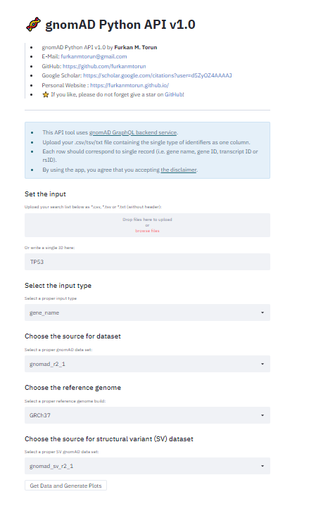

# 🧬 gnomAD Python API

- [🧬 gnomAD Python API](#-gnomad-python-api)
  - [:hash: What is *gnomAD* and the purpose of this script?](#hash-what-is-gnomad-and-the-purpose-of-this-script)
  - [:hash: Requirements and Installation](#hash-requirements-and-installation)
  - [:hash: GUI | Usage](#hash-gui--usage)
  - [:hash: CLI | Usage & Options](#hash-cli--usage--options)
  - [:hash: CLI | Example Usages](#hash-cli--example-usages)
  - [:hash: Disclaimer](#hash-disclaimer)
  - [:hash: Contributing & Feedback](#hash-contributing--feedback)
  - [:hash: Citation](#hash-citation)
  - [:hash: Developer](#hash-developer)

## :hash: What is *gnomAD* and the purpose of this script?
[gnomAD (The Genome Aggregation Database)](http://gnomad.broadinstitute.org/) is aggregation of thousands of exomes and genomes human sequencing studies. Also, gnomAD consortium annotates the variants with allelic frequency in genomes and exomes.

**Here**, this API with both CLI and GUI versions is able to search the genes or transcripts of your interest and retrieve variant data from the database via [gnomAD backend API](https://gnomad.broadinstitute.org/api) that based on GraphQL query language.

## :hash: Requirements and Installation
 - Create a directory and download the "**gnomad_api_cli.py**" and "**requirements.txt**" files or clone the repository via Git using following command:
 
 	`git clone https://github.com/furkanmtorun/gnomad_python_api.git`

 - Install the required packages if you do not already:
 
	` pip3 install -r requirements.txt`

  > The `requirements.txt` contains required libraries for both GUI (graphical user interface) and CLI (command-line interface) versions.

- It's ready to use now! 

> If you did not install **pip** yet, please follow the instruction [here](https://pip.pypa.io/en/stable/installing/).

## :hash: GUI | Usage

In the GUI version of gnomAD Python API, [Streamlit](https://www.streamlit.io/) has been used.

> **Note:** In GUI version, it is possible to generate plots from the data retrieved. 
> This option is not available in CLI version since it is still under development. 
>
> **So, it is recommended to use GUI version.**

- To use GUI version of gnomAD Python API:

  `streamlit run gnomad_api_gui.py`

- Here are the screenshots for the GUI version:

  

  _gnomAD Python API GUI - Main Screen_

  

  _gnomAD Python API GUI - Outputs_

  

  _gnomAD Python API GUI - Outputs and Plots_

> The outputs are also saved into `outputs/` folder in the GUI version. 

## :hash: CLI | Usage & Options
| Options | Description | Parameters |
|--|--|--|
| -filter_by | *It defines the input type.* |`gene_name`, `gene_id`, `transcript_id`, or  `rs_id` |
| -search_by | *It defines the input.* | Type a gene/transcript identifier   *e.g.: TP53, ENSG00000169174, ENST00000544455*   Type the name of file containig your inputs   *e.g: myGenes.txt*
| -dataset | *It defines the dataset.* | `exac`, `gnomad_r2_1`, `gnomad_r3`, `gnomad_r2_1_controls`, `gnomad_r2_1_non_neuro`, `gnomad_r2_1_non_cancer`, or `gnomad_r2_1_non_topmed`
| -sv_dataset | *It defines structural variants dataset.* | `gnomad_sv_r2_1`, `gnomad_sv_r2_1_controls`, or `gnomad_sv_r2_1_non_neuro`
| -h | *It displays the parameters.* | *To get help via script:* `python gnomad_api_cli.py -h`

> ❗ Here, for getting variants, `gnomad_r2_1` and `gnomad_sv_r2_1` are defined as default values for these two `-dataset` and `-sv_dataset` options, respectively.
> 

## :hash: CLI | Example Usages
- **How to list the variants by gene name or gene id?**

  *For gene name:*

  `python gnomad_api_cli.py -filter_by=gene_name -search_by="BRCA1" -dataset="gnomad_r2_1" -sv_dataset="gnomad_sv_r2_1"`

  *For Ensembl gene ID* 

  `python gnomad_api_cli.py -filter_by=gene_id -search_by="ENSG00000169174" -dataset="gnomad_r2_1" -sv_dataset="gnomad_sv_r2_1"`

- **How to list the variants by transcript ID?**

  `python gnomad_api_cli.py -filter_by=transcript_id -search_by="ENST00000407236" -dataset="gnomad_r2_1"`

- **How to get variant info by RS ID (rsId)?**
  
  `python gnomad_api_cli.py -filter_by=rs_id -search_by="rs201857604" -dataset="gnomad_r2_1"`

- **How to list the variants using a file containing genes/transcripts?**

  - Prepare your file that contains gene name, Ensembl gene IDs, Ensembl transcript IDs or RS IDs line-by-line. 
	> ENSG00000169174   ENSG00000171862    ENSG00000170445

  - Then, run the following command:
  
    `python gnomad_api_cli.py -filter_by="gene_id" -search_by="myFavoriteGenes.txt" -dataset="gnomad_r2_1" -sv_dataset="gnomad_sv_r2_1"`

  > Please, use only one type of identifier in the file.

- Then, the variants will be listed in "**outputs**" folder in the folders according to their identifier (gene name, gene id, transcript id or rsId).
  
-  That's all!

## :hash: Disclaimer
All the outputs provided by this tool are for informational purposes only. 

The information is not intended to replace any consultation, diagnosis, and/or medical treatment offered by physicians or healthcare providers.

The author of the app will not be liable for any direct, indirect, consequential, special, exemplary, or other damages arising therefrom.

## :hash: Contributing & Feedback
I would be very happy to see any feedback or contributions to the project.

For problems and enhancement requests, please `open an issue` above. 

## :hash: Citation
Upcoming !

## :hash: Developer
**Furkan M. Torun ([@furkanmtorun](http://github.com/furkanmtorun)) |  [furkanmtorun@gmail.com](mailto:furkanmtorun@gmail.com) |
Academia: [Google Scholar Profile](https://scholar.google.com/citations?user=d5ZyOZ4AAAAJ)**

